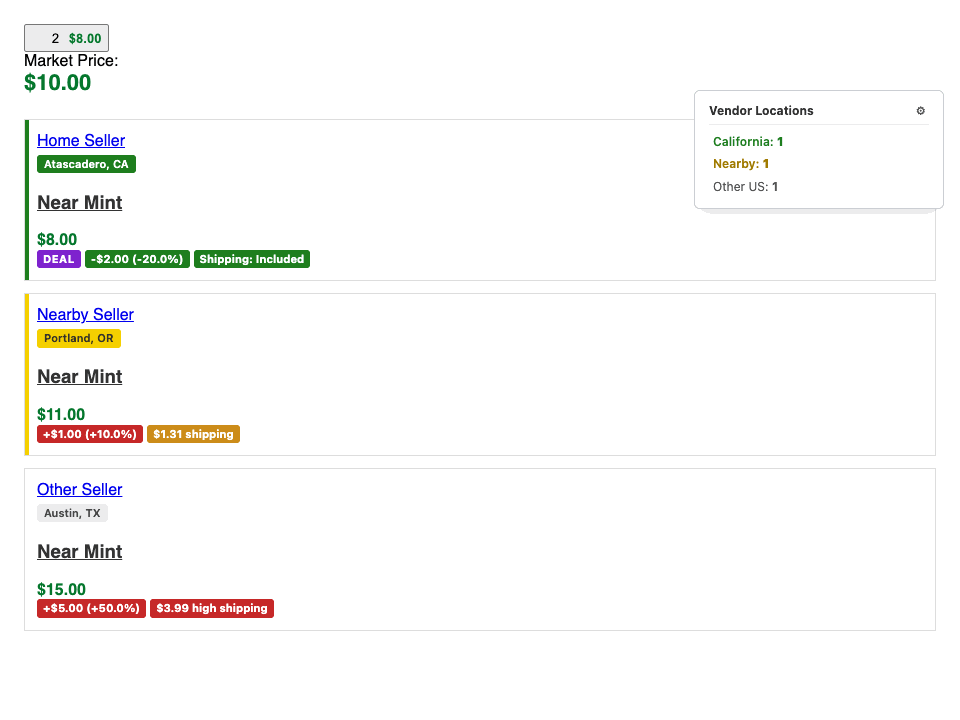
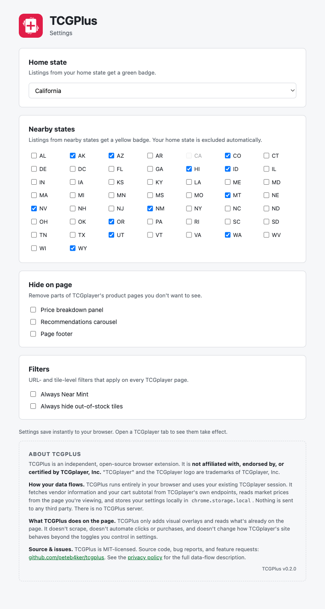

# TCGPlus

TCGPlus adds the price-vs-market delta and shipping cost to every TCGplayer listing, flags the ones that still come in under market once shipping is included, and shows where the seller ships from.

<!-- TODO: record demo.gif and drop into docs/images/ -->

It runs entirely in your browser. The only network calls it makes are to TCGplayer's own APIs.

## Features

TCGPlus runs on TCGplayer product pages, on search pages (the views you use to browse a set or a vendor's listings), and on the cart page. All of the chips, badges, filters, and panel controls below work the same in both places, and the cart page additionally gets a price-vs-market chip on every line item so you can sanity-check what's still a good deal before checking out.

In **grid view** on the search page, where each tile shows one product without a separate shipping line, only the price-vs-market chip appears. List view continues to show the full chip row (delta, shipping, Deal). When you've filtered to a single seller (the "You are shopping from" banner is visible), the seller's location moves up into the banner and the per-listing location badges are suppressed since they'd all be identical.

### Vendor location badges

Every listing gets a city/state badge under the seller's rating, color-coded by where they ship from:

- Green: your home state
- Yellow: your nearby states
- Gray: international
- Uncolored: anywhere else in the US

### Click-to-filter panel

A floating panel summarizes the page by tier (Home / Nearby / Other US). Click a tier to filter the listings to just that group, click again to clear. Counts reflect only the active page. The chosen filter sticks across reloads.

### Price, shipping, and Deal chips

Each listing gets a row of chips that show price-vs-market, shipping cost, and whether the all-in cost is a deal.

- **Price-vs-market chip**: how far the price is from the page's market price, e.g. `+$5.00 (+16.7%)`. Solid green below market. Above market shifts from yellow through orange to red, hitting full red at 10% over.
- **Shipping chip**: replaces the plain "+ $X.XX Shipping" line. Green when shipping is included, yellow under $2, red at $2 or more (labelled "high shipping").
- **Deal chip**: a purple "DEAL" badge appears in front of the others when the listing's all-in cost would still beat the market price. The math factors in any "Free Shipping on Orders Over $X" promo on the listing, but only when the user's existing cart subtotal _with that same seller_ plus the listing's price clears the global free-shipping threshold (currently $5). If the listing is from a seller already in the cart, the Deal chip will start appearing once you've added enough to qualify.

When a tile or product page shows listings across different variants (Normal / Holofoil / Reverse Holofoil) or different conditions (NM / LP / MP / HP / DM), each listing chips against its **own SKU's market price**, not the page's headline market. The extension fetches per-SKU market prices from TCGplayer's own pricing endpoints and matches each listing by (condition, variant) before computing the delta. A Reverse Holofoil Near Mint listing in a tile whose headline market is the Holofoil Near Mint price will correctly show the delta against the Reverse Holofoil market, not the Holofoil one.

If the per-SKU lookup is unavailable (TCGplayer API down, unknown variant), the chip falls back to the headline market price but only on listings whose condition matches the headline — mismatched variants/conditions get the shipping chip only rather than a misleading delta.

**Below market**

**Near market**

**Above market**

### Cart subtotal in the header

The cart icon in TCGplayer's header normally shows the item count. TCGPlus adds the cart's current subtotal next to it in the same green text TCGplayer uses for listing prices, so you can see what you're spending without opening the cart. It always shows, even at `$0.00`. The number refreshes whenever the count badge changes, so adding or removing an item updates it automatically. Same number is what feeds the Deal-chip math.

### Settings page

Click the gear icon on the floating panel, click the TCGPlus icon in your browser toolbar, or open **Extension options** from `chrome://extensions` — they all open the same dedicated settings page:

- **Home state**: pick any US state. Default is California.
- **Nearby states**: tick zero or more. The home state is auto-disabled so you can't pick it twice. Default is the western US set (OR, WA, NV, AZ, ID, UT, MT, WY, CO, NM, AK, HI).
- **Hide on page**: checkboxes to hide TCGplayer's price-breakdown panel, recommendations carousel, and footer.
- **Always Near Mint**: when on, any product or search page URL without `Condition=Near+Mint` is rewritten to include it before the listings render. Off by default.
- **Hide tiles with no matching listings**: when on, any search-result tile that has no listings matching the current search is hidden. TCGplayer flags these with an "Out of Stock" badge, but in practice it usually means a language or condition mismatch rather than true unavailability — e.g. a Japanese-language card showing up on a `Language=English` search, or a card whose only listings are LP/MP on a `Condition=Near+Mint` search. Off by default. Whenever a search-grid page has at least one of these tiles, a slim banner appears above the grid with a count (e.g. "8 tiles with no listings matching your filters") and a toggle button — so a hidden tile is never silent, and you can flip the setting without leaving the page.

Settings are stored in `chrome.storage.local`. Changes apply live to any open TCGplayer tab — no reload needed.

### How it works

TCGPlus only calls TCGplayer's own APIs:

- `seller-stores-backend.tcgplayer.com/sm/seller/<key>` for each unique vendor on the page (used for the location badge).
- `mpgateway.tcgplayer.com/v1/cart/<key>/summary` for the cart subtotal and per-seller breakdown.
- `mp-search-api.tcgplayer.com/v2/product/<id>/details` for the SKU catalogue of each product (variant + condition), and `mpgateway.tcgplayer.com/v1/pricepoints/marketprice/skus/search` for per-SKU market prices. These power the variant-aware delta chip on product, search-list, and cart pages.

The page's headline market price is read from the page DOM as a fallback when per-SKU pricing isn't available. Nothing is sent anywhere else. Full details in the [privacy policy](docs/privacy.md).

## Development

Plain MV3, no build step. Edit `content.js` and `content.css`, hit reload on the extension in `chrome://extensions`, then refresh the TCGplayer tab.

CI on GitHub Actions validates `manifest.json` and runs `node --check` on the content script. Pushing a `v*` tag builds a zip and attaches it to a GitHub Release.

The fetch targets are `https://seller-stores-backend.tcgplayer.com/sm/seller/<key>` (vendor info), `https://mpgateway.tcgplayer.com/v1/cart/<key>/summary` (cart subtotal), `https://mp-search-api.tcgplayer.com/v2/product/<id>/details` (per-product SKU catalogue), and `https://mpgateway.tcgplayer.com/v1/pricepoints/marketprice/skus/search` (per-SKU market prices). All four are listed as host permissions in the manifest. The page's headline market price is read from the DOM at `.price-points__upper__price` as a fallback only.

### Install from source

For local development or testing an unreleased build:

1. Clone this repo, or download the latest [release zip](../../releases).
2. In Chrome, open `chrome://extensions`.
3. Turn on **Developer mode** (top right).
4. Click **Load unpacked** and select this directory.
5. Visit any product page (`https://www.tcgplayer.com/product/*`) or search page (`https://www.tcgplayer.com/search/*`).

## License

MIT, see [LICENSE](LICENSE).
