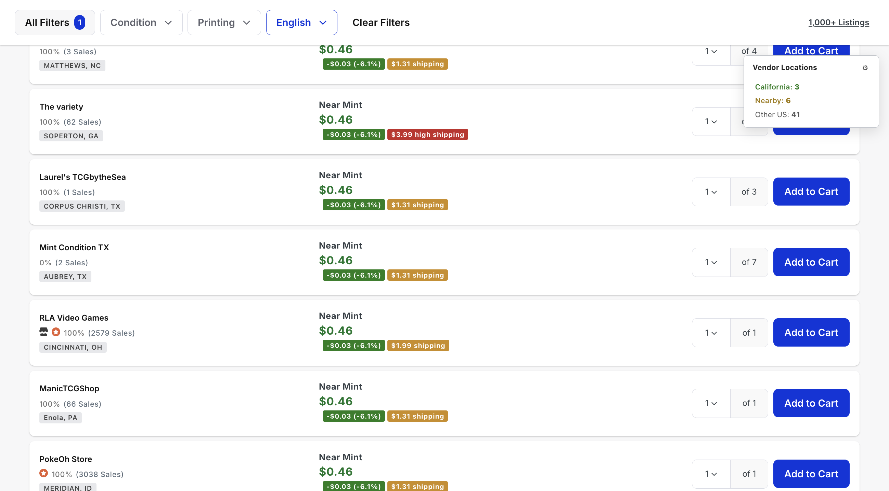
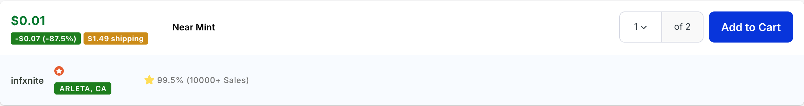
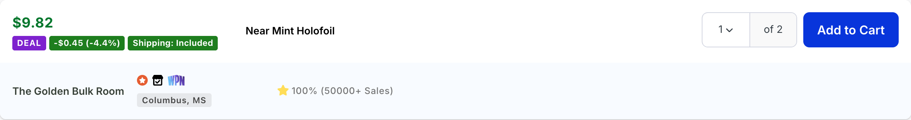
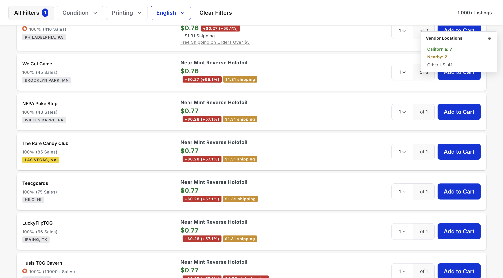
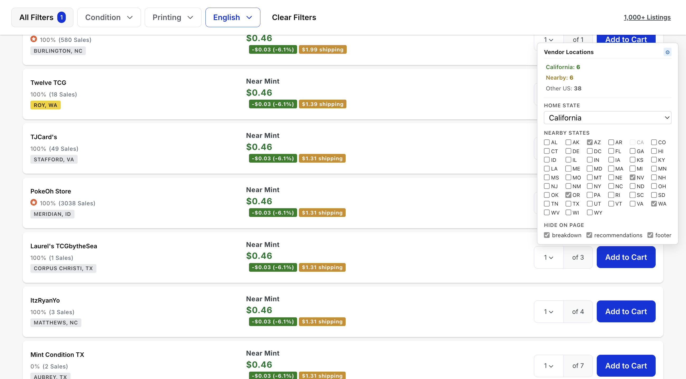

# TCGPlus

TCGPlus is a Chrome extension for [TCGplayer](https://www.tcgplayer.com). It reduces friction in the navigation experience so you can search and buy faster.

## Features

### Vendor location badges
Every listing gets a city/state badge under the seller's rating, color-coded by where they ship from:

- Green: your home state
- Yellow: your nearby states
- Gray: international
- Uncolored: anywhere else in the US

### Click-to-filter panel
A floating panel summarizes the page by tier (Home / Nearby / Other US). Click a tier to filter the listings to just that group, click again to clear. Counts reflect only the active page. The chosen filter sticks across reloads.

### Price, shipping, and Deal chips
Each listing gets a row of chips that show price-vs-market, shipping cost, and whether the all-in cost is a deal.

- **Price-vs-market chip**: how far the price is from the page's market price, e.g. `+$5.00 (+16.7%)`. Solid green below market. Above market shifts from yellow through orange to red, hitting full red at 10% over.
- **Shipping chip**: replaces the plain "+ $X.XX Shipping" line. Green when shipping is included, yellow under $2, red at $2 or more (labelled "high shipping").
- **Deal chip**: a purple "DEAL" badge appears in front of the others when the listing's all-in cost would still beat the market price. The math factors in any "Free Shipping on Orders Over $X" promo on the listing, but only when the user's existing cart subtotal *with that same seller* plus the listing's price clears the global free-shipping threshold (currently $5). If the listing is from a seller already in the cart, the Deal chip will start appearing once you've added enough to qualify.

| Below market | Near market | Above market |
|---|---|---|
|  |  |  |

### Cart subtotal in the header
The cart icon in TCGplayer's header normally shows the item count. TCGPlus adds the cart's current subtotal next to it in the same green text TCGplayer uses for listing prices, so you can see what you're spending without opening the cart. It always shows, even at `$0.00`. The number refreshes whenever the count badge changes, so adding or removing an item updates it automatically. Same number is what feeds the Deal-chip math.

### Settings drawer
The gear icon on the panel opens settings:

- **Home state**: pick any US state. Default is California.
- **Nearby states**: tick zero or more. The home state is auto-disabled so you can't pick it twice. Default is the western US set (OR, WA, NV, AZ, ID, UT, MT, WY, CO, NM, AK, HI).
- **Hide on page**: checkboxes to hide TCGplayer's price-breakdown panel, recommendations carousel, and footer.

Settings are stored in `localStorage`. Changing the home or nearby states reclassifies listings on the spot without re-fetching anything.

### How it works
TCGPlus only calls TCGplayer's own APIs:

- `seller-stores-backend.tcgplayer.com/sm/seller/<key>` for each unique vendor on the page (used for the location badge).
- `mpgateway.tcgplayer.com/v1/cart/<key>/summary` for the cart subtotal and per-seller breakdown.

The market price is read straight from the page DOM. Nothing is sent anywhere else.

## Install (from source)

1. Clone this repo, or download the latest [release zip](../../releases).
2. In Chrome, open `chrome://extensions`.
3. Turn on **Developer mode** (top right).
4. Click **Load unpacked** and select this directory.
5. Visit any page under `https://www.tcgplayer.com/product/*`.

## Development

Plain MV3, no build step. Edit `content.js` and `content.css`, hit reload on the extension in `chrome://extensions`, then refresh the TCGplayer tab.

CI on GitHub Actions validates `manifest.json` and runs `node --check` on the content script. Pushing a `v*` tag builds a zip and attaches it to a GitHub Release.

The fetch targets are `https://seller-stores-backend.tcgplayer.com/sm/seller/<key>` (vendor info) and `https://mpgateway.tcgplayer.com/v1/cart/<key>/summary` (cart subtotal). Both are listed as host permissions in the manifest. Market price is read from the page DOM at `.price-points__upper__price`.

## License

MIT, see [LICENSE](LICENSE).
